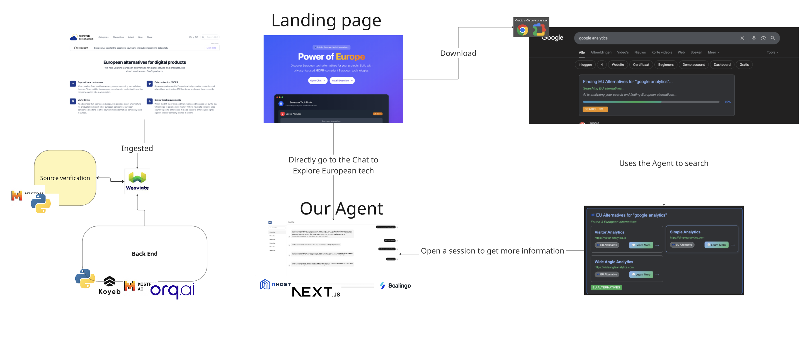

# 💬 Saipiens - European Tech Sovereignty - Nhost + Mistral AI Template

A **modern ChatGPT-style interface** powered by **Mistral AI**, built with **Next.js 15**, **Nhost.io**, and **shadcn/ui**. This template provides a complete AI chat application with authentication, intelligent responses, thread management, and a beautiful responsive design, all focused on European digital sovereignty.


## Overview European Tech




## ✨ Features

### 🤖 **Mistral AI Integration**
- **Intelligent AI Responses** - Powered by Mistral AI's `mistral-small-latest` model
- **Conversation Context** - Maintains chat history for contextual responses
- **Secure API Integration** - Server-side API routes protect your API keys
- **Error Handling** - Graceful fallbacks when AI service is unavailable
- **Loading States** - Visual feedback during AI response generation
- **TypeScript Support** - Fully typed AI service integration

### 💬 **ChatGPT-Style Interface**
- **Modern Chat UI** - Clean, responsive chat interface
- **Thread Management** - Create and switch between conversations
- **Message Bubbles** - Properly styled user and AI messages
- **Sidebar Navigation** - Collapsible thread list with mobile support
- **Real-time Messaging** - Smooth message sending and receiving
- **AI-Powered Conversations** - Get intelligent responses from Mistral AI

### 🔐 **Complete Authentication System**
- **Email/Password Authentication** with Nhost
- **Email Verification Flow** with resend functionality
- **Protected Chat Routes** - Authentication required for chat access
- **Persistent Auth State** across page refreshes
- **User Profile Integration** in chat sidebar

### 🎨 **Modern UI/UX with shadcn/ui**
- **shadcn/ui Design System** - Professional, accessible components
- **Clean, Modern Interface** - ChatGPT-inspired design
- **Lucide React Icons** - Consistent iconography throughout
- **Responsive Design** that works on all devices
- **Mobile-First** chat interface with touch-friendly controls
- **Smooth Animations** and loading states

### 🛡️ **Security & Best Practices**
- **Protected Routes** with authentication guards
- **Email Verification Required** for chat access
- **Secure Environment Variables** handling
- **TypeScript** for type safety
- **Error Handling** with user-friendly messages
- **Keyboard Navigation** support for accessibility

### 🔧 **Developer Experience**
- **Next.js 15** with App Router
- **shadcn/ui** - Modern component library
- **Tailwind CSS** for styling
- **TypeScript** for type safety
- **Lucide React** for icons
- **ESLint & Prettier** configured
- **Hot Reload** development server
- **Comprehensive Documentation**

## 🎯 Live Demo

You can view the agent here ([https://saipiens.osc-fr1.scalingo.io/](https://saipiens.osc-fr1.scalingo.io/))

## 🚀 Quick Start

### Prerequisites
- Node.js 18+ 
- npm or yarn
- Nhost account ([Sign up free](https://app.nhost.io))

### 1. Clone & Install

```bash
git clone https://github.com/your-username/nhost-next-template.git
cd nhost-next-template/nhost-next
npm install
```

### 2. Set up Nhost Project

1. **Create Nhost Project**:
   - Go to [Nhost Dashboard](https://app.nhost.io)
   - Click "Create New Project"
   - Choose your region and project name

2. **Get Project Credentials**:
   - Copy your **Subdomain** and **Region** from the dashboard

3. **Configure Environment**:
   ```bash
   cp .env.example .env.local
   ```
   
   Update `.env.local`:
   ```env
   NEXT_PUBLIC_NHOST_SUBDOMAIN=your-project-subdomain
   NEXT_PUBLIC_NHOST_REGION=your-project-region
   MISTRAL_API_KEY=your-mistral-api-key
   ```

### 3. Set up Mistral AI

1. **Get Mistral API Key**:
   - Go to [Mistral AI Console](https://console.mistral.ai/)
   - Sign up or log in to your account
   - Navigate to "API Keys" section
   - Create a new API key

2. **Add API Key to Environment**:
   - Copy your Mistral API key
   - Add it to your `.env.local` file:
   ```env
   MISTRAL_API_KEY=your-mistral-api-key-here
   ```

3. **Verify Integration**:
   - The app uses `mistral-small-latest` model by default
   - API calls are made securely through server-side routes
   - Your API key is never exposed to the client

### 4. Set up Sample Database (Optional)

For the movies demo data, run this SQL in your Nhost SQL Editor:

```sql
CREATE TABLE movies (
  id SERIAL PRIMARY KEY,
  title VARCHAR(255) NOT NULL,
  director VARCHAR(255),
  release_year INTEGER,
  genre VARCHAR(100),
  rating FLOAT
);

INSERT INTO movies (title, director, release_year, genre, rating) VALUES
  ('Inception', 'Christopher Nolan', 2010, 'Sci-Fi', 8.8),
  ('The Godfather', 'Francis Ford Coppola', 1972, 'Crime', 9.2),
  ('Forrest Gump', 'Robert Zemeckis', 1994, 'Drama', 8.8),
  ('The Matrix', 'Lana Wachowski, Lilly Wachowski', 1999, 'Action', 8.7);
```

**Important**: Enable "Track this" and set permissions for the `public` role.

### 5. Run Development Server

```bash
npm run dev
```

Open [http://localhost:3000](http://localhost:3000) to see your app! 🎉

## 🤖 Using Mistral AI Chat

Once your app is running:

1. **Sign up** and **verify your email** through the authentication flow
2. **Navigate to `/chat`** to access the AI chat interface
3. **Start chatting** - your messages will be sent to Mistral AI
4. **Create new threads** to organize different conversations
5. **Switch between conversations** using the sidebar

### 🔧 **Mistral AI Features**

- **Context-Aware**: The AI remembers your conversation history
- **Secure**: API keys are handled server-side for security
- **Error Handling**: Graceful fallbacks if the AI service is unavailable
- **Loading States**: Visual feedback while generating responses
- **Thread Management**: Organize conversations by topic

## 📱 Authentication Flow

### 🔄 **Complete User Journey**

1. **Landing Page** (`/`)
   - Shows different content for authenticated/unauthenticated users
   - Beautiful feature showcase
   - Call-to-action buttons

2. **Authentication** (`/auth`)
   - **Sign Up**: Creates account + sends verification email
   - **Sign In**: Logs in existing users
   - **Smart Redirects**: Based on verification status

3. **Email Verification** (`/auth/verify-email`)
   - **Required** for new users
   - **Resend Email** functionality
   - **Clear Instructions** and status updates

4. **Dashboard** (`/dashboard`)
   - **Protected Route** - requires verified email
   - **User Information** display
   - **Sample Data** from GraphQL API
   - **Sign Out** functionality

### 🛡️ **Route Protection Logic**

```typescript
// AuthWrapper handles all routing logic
if (!authenticated) {
  redirect('/auth')  // Public pages only
}

if (authenticated && !emailVerified) {
  redirect('/auth/verify-email')  // Must verify email
}

if (authenticated && emailVerified) {
  redirect('/dashboard')  // Full access
}
```

## 📁 Project Structure

```
src/
├── app/
│   ├── auth/
│   │   ├── page.tsx              # 🔐 Login/Signup page (shadcn forms)
│   │   └── verify-email/
│   │       └── page.tsx          # ✉️ Email verification (shadcn cards)
│   ├── chat/
│   │   └── page.tsx              # 💬 ChatGPT-style interface
│   ├── settings/
│   │   └── page.tsx              # ⚙️ User settings and dashboard
│   ├── components/
│   │   ├── AuthWrapper.tsx       # 🛡️ Route protection
│   │   ├── Providers.tsx         # 🔧 Context providers
│   │   └── ui/                   # 🎨 shadcn/ui components
│   │       ├── button.tsx
│   │       ├── card.tsx
│   │       ├── input.tsx
│   │       ├── label.tsx
│   │       ├── alert.tsx
│   │       ├── badge.tsx
│   │       ├── avatar.tsx
│   │       └── separator.tsx
│   ├── layout.tsx                # 🎨 Root layout
│   └── page.tsx                  # 🌟 Landing page (clean design)
├── lib/
│   ├── nhost.ts                  # ⚙️ Nhost client config
│   └── utils.ts                  # 🔧 shadcn/ui utilities
└── ...
```

## 🎨 shadcn/ui Components & Design

### **🏠 Landing Page**
- **Clean Hero Section** - No gradients, modern typography
- **Feature Cards** - shadcn Card components with icons
- **Tech Stack Badges** - shadcn Badge components
- **CTA Buttons** - shadcn Button with variants
- **Responsive Grid Layout** - Mobile-first design

### **🔐 Authentication Forms**
- **shadcn Card Layout** - Professional form container
- **shadcn Input & Label** - Accessible form controls
- **Toggle Sign Up/Sign In** - Smooth state management
- **shadcn Alert Components** - Error/success messages
- **Loading States** - Lucide Loader2 icons
- **Black Background** - Modern, high-contrast design

### **✉️ Email Verification**
- **shadcn Card Structure** - Clean, organized layout
- **Lucide Icons** - Mail, ArrowLeft, Loader2
- **shadcn Alert System** - Status feedback
- **shadcn Buttons** - Consistent interaction patterns
- **Professional Typography** - Clear hierarchy

### **📊 Dashboard**
- **Stats Overview Cards** - Key metrics at a glance
- **User Profile Section** - Organized with Lucide icons
- **Modern Movie Cards** - Replaced table with card layout
- **Star Ratings** - Visual rating system
- **Status Badges** - Color-coded verification status
- **Avatar Component** - User profile representation

## 🔧 Configuration

### **Environment Variables**

| Variable | Description | Required |
|----------|-------------|---------|
| `NEXT_PUBLIC_NHOST_SUBDOMAIN` | Your Nhost project subdomain | ✅ Yes |
| `NEXT_PUBLIC_NHOST_REGION` | Your Nhost project region | ✅ Yes |

### **Nhost Configuration**

```typescript
// src/lib/nhost.ts
export const nhost = new NhostClient({
  subdomain: process.env.NEXT_PUBLIC_NHOST_SUBDOMAIN,
  region: process.env.NEXT_PUBLIC_NHOST_REGION,
})
```

## 🚀 Deployment

### **Vercel (Recommended)**

1. **Push to GitHub**:
   ```bash
   git add .
   git commit -m "Initial commit"
   git push origin main
   ```

2. **Deploy on Vercel**:
   - Connect your GitHub repository
   - Add environment variables in Vercel dashboard
   - Deploy automatically

3. **Environment Variables**:
   ```
   NEXT_PUBLIC_NHOST_SUBDOMAIN=your-subdomain
   NEXT_PUBLIC_NHOST_REGION=your-region
   ```

### **Other Platforms**
- **Netlify**: Works out of the box
- **Railway**: Add environment variables
- **Render**: Configure build settings
- **AWS Amplify**: Set environment variables

## 🛠️ Development

### **Available Scripts**

```bash
npm run dev      # Start development server
npm run build    # Build for production
npm run start    # Start production server
npm run lint     # Run ESLint
```

### **Development Tips**

- **Hot Reload**: Changes reflect instantly
- **TypeScript**: Full type checking
- **Console Logs**: Check browser console for debugging
- **Network Tab**: Monitor GraphQL requests

## 🔍 Troubleshooting

### **Common Issues**

**❌ "createContext only works in Client Components"**
- ✅ Fixed: Using `Providers.tsx` wrapper with `'use client'`

**❌ Authentication not working**
- ✅ Check environment variables are set correctly
- ✅ Verify Nhost project is active
- ✅ Check browser console for errors

**❌ Email verification not received**
- ✅ Check spam folder
- ✅ Use resend functionality
- ✅ Verify email settings in Nhost dashboard

## 📚 Learn More

### **Documentation**
- [Nhost Documentation](https://docs.nhost.io) - Learn about Nhost features
- [Next.js Documentation](https://nextjs.org/docs) - Next.js guides and API
- [Tailwind CSS](https://tailwindcss.com/docs) - Styling documentation

### **Tutorials**
- [Nhost + Next.js Guide](https://docs.nhost.io/guides/quickstarts/nextjs)
- [Authentication Best Practices](https://docs.nhost.io/guides/auth)
- [GraphQL with Nhost](https://docs.nhost.io/guides/database)

## 🤝 Contributing

Contributions are welcome! Please feel free to submit a Pull Request.

### **Development Setup**
1. Fork the repository
2. Create a feature branch
3. Make your changes
4. Test thoroughly
5. Submit a pull request

## 📄 License

This project is open source and available under the [MIT License](LICENSE).

---

**Built with ❤️ using Nhost + Next.js**

*Happy coding! 🚀*
